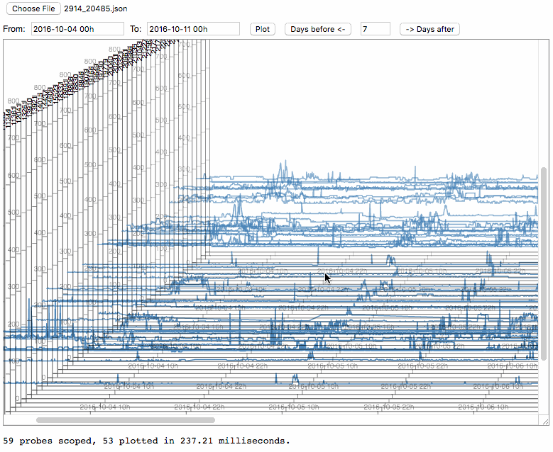

# What is it about?
This project allows visualization of multiple timeseries plotted
with perspective effect.

More specifically, we use this tool to visually explore the RTT 
traces spanning over several months of hundreds of probes grouped by the AS link they pass through.
With this and topological information, we are available to identify congestion shared
by probe groups and further locate where the congestion probably happens.



RIPE Atlas provides as well an awesome tool [LatencyMon](https://atlas.ripe.net/docs/tools-latencymon/) 
to visualize multiple probes traces in a measurement.
The tools provides great flexibility in grouping probes and friendly
interface for navigating the trace.
However, it falls short in following aspects:

1. not possible to group probe by the path traversed;
2. not scalable enough to filter out probes from measurements involving
a great number of probes, say RIPE Atlas built-in measurements;
3. the visual presentation is not adapted to the case where hundreds of probes could be involved.

# How to use it?
1. Extract groups of probe traces indicated in txt files and parse them in json format fit for plotting.
2. Select json file visualize it with the tool.

## RTT trace extraction
Ping measurements from RIPE Atlas are the input.
In a previous project, we collected ping measurements from more than 6000 probes toward DNS b-root over 3 months.
These traces are cut into chunks and stored in multiple files, see the [docs](https://github.com/WenqinSHAO/rtt/blob/master/docs/data_collection.md)
for more details.

With [topology visualization](https://github.com/WenqinSHAO/as_topo.git), 
we grouped probes that traverse a same AS path and stored these probe IDs in a txt file.

In this part, we would like to extract the Ping measurements for probes grouped in a same txt file,
parse them and store them in a single json file ready for plot.

More specifically:
```
$ python queryrtt.py -h
usage: queryrtt.py [-h] [-p PROBEDIRECTORY] [-t TRACEDIRECTORY] [-i INDEXFILE]
                   [-s CHUNCKSUFFIX]

optional arguments:
  -h, --help            show this help message and exit
  -p PROBEDIRECTORY, --probeDirectory PROBEDIRECTORY
                        the directory storing probe IDs grouped by link
  -t TRACEDIRECTORY, --traceDirectory TRACEDIRECTORY
                        the directory storing all the ping measurements chunks
  -i INDEXFILE, --indexFile INDEXFILE
                        the file that maps probe ID to chunk IDs
  -s CHUNCKSUFFIX, --chunckSuffix CHUNCKSUFFIX
                        chunks suffix is distinguish different measurements,
                        say, 1010.json, v4 ping for b-root
```

The generated json file has the same prefix/name as the txt file with probe IDs.
The json is in the following format:
```
{
  "probe ID in string": [
    {
      "epoch": int, second since epoch,
      "value": numeric, here the RTT in msec,
     },
    {
      ...
    }
    ...
  ],
  "another probe ID in string": [{...},...],
  ...
}
```

## Visualization in web
Open [rtt.html](./rtt.html) in Chrome/Safari allows you to visualize a selected json file previously generated
as shown in the above screenshot.
On can navigate in time by setting a begin and end datetime in the format __%Y-%m-%d %Hh__ or simple use after or before button
to go through the entire duration.

# Requirements
[d3](https://d3js.org) is required in [js_lib/vis.js](./js_lib/vis.js).
